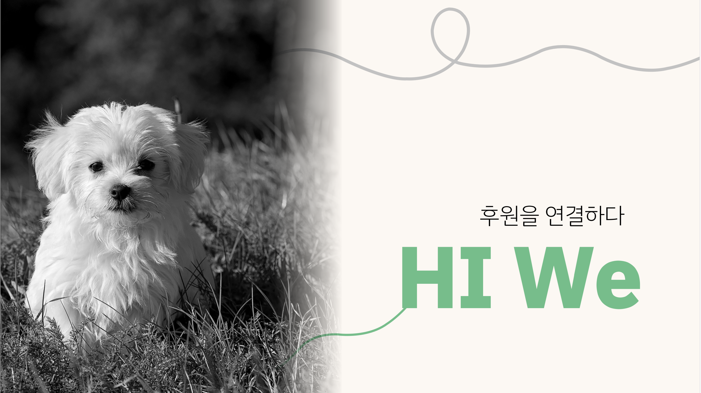

# HI We - 후원을 연결하다

<p align="center">
  <br>
    
  <br>
</p>

HI We : 후원자와 피후원 단체 및 동물과 연결하는 웹 사이트 구현

<br>

## 기술 스택

|  React   |  NEXT.JS  | TypeScript |  Emotion   |
| :------: | :-------: | :--------: | :--------: |
| ![react] | ![nextjs] |   ![ts]    | ![emotion] |

<br>

## 진행 목적

- `React`, `NEXT.JS`, `TypeScript` 사용
- CSS-IN-JS 프레임워크 `Emotion` 사용
- `Recoil`로 state 관리
- mobile, tablet, pc 버전을 고려한 반응형 UI 디자인

<br>

## 구현 요구 사항

- [✅] 구조 이해가 쉬운 presentational & container 디자인 패턴
- [✅] 심플하고 가독성이 높은 UI
- [✅] 사용자 화면을 고려한 반응형 웹 사이트
- [✅] 로그인 기능 구현 (로그인, 로그아웃, 회원가입)
- [✅] Kakao 지도 API 연동
- [✅] PG사 결제모듈에 대한 결제 호스팅 서비스 아임포트(I'mport) 연동

<br>

## 사용한 프레임워크 / 라이브러리 설명

- React: 컴포넌트 기반의 화면구성, Virtual DOM으로 인한 속도 향상, SPA(싱글 페이지 애플리케이션)
- NEXT.JS: React에서 SSR(서버 사이드 렌더링)을 지원하는 NEXT.JS 사용
- TypeScript: 초기 데이터와 컴포넌트 사이에 전달되는 데이터의 컴파일 오류를 방지하기 위해 사용
- Emotion: SSR에서 별도의 설정 없이 동작되는 Emotion 사용

<br>

## 실행 방법

```
yarn install
yarn dev
```

<!-- ## File 구조

```bash
📦pages
┣ 📂ChargePoint
┃ ┗ 📜index.tsx
┣ 📂basket
┃ ┗ 📜index.tsx
┣ 📂board
┃ ┣ 📂[id]
┃ ┃ ┣ 📂edit
┃ ┃ ┃ ┗ 📜index.tsx
┃ ┃ ┗ 📜index.tsx
┃ ┣ 📂write
┃ ┃ ┗ 📜index.tsx
┃ ┗ 📜index.tsx
┣ 📂login
┃ ┗ 📜index.tsx
┣ 📂main
┃ ┗ 📜index.tsx
┣ 📂myaccount
┃ ┗ 📜index.tsx
┣ 📂signup
┃ ┗ 📜index.tsx
┣ 📂sponsor
┃ ┣ 📂[id]
┃ ┃ ┣ 📂edit
┃ ┃ ┃ ┗ 📜index.tsx
┃ ┃ ┗ 📜index.tsx
┃ ┣ 📂write
┃ ┃ ┗ 📜index.tsx
┃ ┗ 📜index.tsx
┣ 📜_app.tsx
┗ 📜index.tsx
``` -->
<!-- Stack Icon Refernces -->

[react]: /public/image/stack/react.svg
[ts]: /public/image/stack/typescript.svg
[nextjs]: /public/image/stack/nextjs.svg
[emotion]: /public/image/stack/emotion.svg

<!-- [recoil]: /public/image/stack/recoil.svg -->
